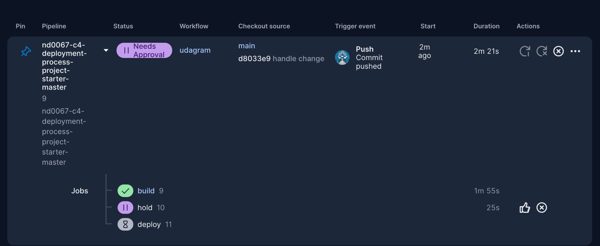

<!-- # Hosting a Full-Stack Application

### **You can use you own project completed in previous courses or use the provided Udagram app for completing this final project.**

---

In this project you will learn how to take a newly developed Full-Stack application built for a retailer and deploy it to a cloud service provider so that it is available to customers. You will use the aws console to start and configure the services the application needs such as a database to store product information and a web server allowing the site to be discovered by potential customers. You will modify your package.json scripts and replace hard coded secrets with environment variables in your code.

After the initial setup, you will learn to interact with the services you started on aws and will deploy manually the application a first time to it. As you get more familiar with the services and interact with them through a CLI, you will gradually understand all the moving parts.

You will then register for a free account on CircleCi and connect your Github account to it. Based on the manual steps used to deploy the app, you will write a config.yml file that will make the process reproducible in CircleCi. You will set up the process to be executed automatically based when code is pushed on the main Github branch.

The project will also include writing documentation and runbooks covering the operations of the deployment process. Those runbooks will serve as a way to communicate with future developers and anybody involved in diagnosing outages of the Full-Stack application.

# Udagram

This application is provided to you as an alternative starter project if you do not wish to host your own code done in the previous courses of this nanodegree. The udagram application is a fairly simple application that includes all the major components of a Full-Stack web application.

### Dependencies

```
- Node v14.15.1 (LTS) or more recent. While older versions can work it is advisable to keep node to latest LTS version

- npm 6.14.8 (LTS) or more recent, Yarn can work but was not tested for this project

- AWS CLI v2, v1 can work but was not tested for this project

- A RDS database running Postgres.

- A S3 bucket for hosting uploaded pictures.

```

### Installation

Provision the necessary AWS services needed for running the application:

1. In AWS, provision a publicly available RDS database running Postgres. <Place holder for link to classroom article>
1. In AWS, provision a s3 bucket for hosting the uploaded files. <Place holder for tlink to classroom article>
1. Export the ENV variables needed or use a package like [dotnev](https://www.npmjs.com/package/dotenv)/.
1. From the root of the repo, navigate udagram-api folder `cd starter/udagram-api` to install the node_modules `npm install`. After installation is done start the api in dev mode with `npm run dev`.
1. Without closing the terminal in step 1, navigate to the udagram-frontend `cd starter/udagram-frontend` to intall the node_modules `npm install`. After installation is done start the api in dev mode with `npm run start`.

## Testing

This project contains two different test suite: unit tests and End-To-End tests(e2e). Follow these steps to run the tests.

1. `cd starter/udagram-frontend`
1. `npm run test`
1. `npm run e2e`

There are no Unit test on the back-end

### Unit Tests:

Unit tests are using the Jasmine Framework.

### End to End Tests:

The e2e tests are using Protractor and Jasmine.

## Built With

- [Angular](https://angular.io/) - Single Page Application Framework
- [Node](https://nodejs.org) - Javascript Runtime
- [Express](https://expressjs.com/) - Javascript API Framework

## License

[License](LICENSE.txt) -->

<!-- # Udagram Deployment Project

## Project Overview

Udagram is a cloud-deployed application that includes a front-end Angular single-page application (SPA) and a back-end RESTful API. The API provides user authentication and image-related services, while the front-end allows users to log in, upload photos, and view the feed.

This project demonstrates a full CI/CD pipeline using CircleCI and AWS services including:

- AWS RDS for PostgreSQL database
- AWS Elastic Beanstalk for API hosting
- AWS S3 for static front-end hosting

---

## Project Architecture


---

## Pipeline Overview


---

## Hosted Application Links

- **Frontend (S3 Hosted):** [https://your-s3-url.amazonaws.com](https://your-s3-url.amazonaws.com)
- **API (Elastic Beanstalk):** [http://your-api-env.elasticbeanstalk.com/api/v0/](http://your-api-env.elasticbeanstalk.com/api/v0/)

---

## CircleCI Build

### ✅ Last Successful Build Screenshots

- **Build Phase:** 
- **Hold Phase:** 
- **Deploy Phase:** 

---

## AWS Infrastructure Screenshots

- **RDS (Postgres):**
  

- **Elastic Beanstalk (API):**
  

- **S3 (Frontend):**
  

---

## Project Structure

```bash
├── .circleci/
│   └── config.yml
├── udagram/
│   ├── udagram-api/        # Express API
│   └── udagram-frontend/   # Angular frontend
├── docs/
│   ├── architecture-diagram.png
│   ├── pipeline-diagram.png
│   ├── aws-rds.png
│   ├── aws-eb.png
│   ├── aws-s3.png
│   ├── circleci-build.png
│   ├── circleci-hold.png
│   ├── circleci-deploy.png
│   ├── Infrastructure_description.md
│   ├── Pipeline_description.md
│   └── Application_dependencies.md
├── package.json
└── README.md
``` -->

# Udagram Deployment Project

This project is the final submission for the Udacity Cloud DevOps Engineer Nanodegree. It demonstrates the deployment of a full-stack application called **Udagram**, which includes a frontend Angular app and a backend Node.js API.

## Project Overview

Udagram is an image sharing platform that allows users to register, log in, post images, and view feeds. The frontend is built with Angular and deployed on AWS S3, while the backend API is deployed on AWS Elastic Beanstalk and uses an AWS RDS PostgreSQL instance for data storage.

## Project Structure

```
.
├── udagram
│   ├── udagram-frontend      # Angular frontend
│   └── udagram-api           # Node.js backend API
├── .circleci
│   └── config.yml            # CircleCI pipeline configuration
├── package.json              # Root level scripts
├── README.md                 # Project documentation
└── docs
    ├── Infrastructure_description.md
    ├── Pipeline_description.md
    └── Application_dependencies.md
```

## Infrastructure

The infrastructure includes:

- **Frontend Hosting**: AWS S3 with static website hosting enabled.
- **Backend Hosting**: AWS Elastic Beanstalk with Node.js.
- **Database**: AWS RDS PostgreSQL instance.

## Architecture Diagram (Text Representation)

```
User --> [S3 Frontend Hosting]
           |
           v
      [Elastic Beanstalk API]
           |
           v
        [RDS Postgres DB]
```

## Pipeline Overview

CircleCI is used for the CI/CD pipeline with the following steps:

- Install frontend and backend dependencies.
- Run lint checks.
- Build frontend and backend apps.
- Hold job for manual approval.
- Deploy backend to Elastic Beanstalk.
- Deploy frontend to S3.

## Important Links

- **Frontend App**: http://myawsbucket-01155187731.s3-website-us-east-1.amazonaws.com
- **Elastic Beanstalk Backend Endpoint**: http://udagram-api-dev.us-east-1.elasticbeanstalk.com/
- **CircleCI Pipeline**: https://app.circleci.com/pipelines/github/ayaaboud/nd0067-c4-deployment-process-project-starter-master

## How to Use

1. Clone the repo.
2. Configure environment variables and `.env` files.
3. Run the project locally using `npm run frontend:start` and `npm run api:start`.
4. Ensure the backend is correctly connected to your RDS instance.
5. Commit your code and let CircleCI handle the deployment.

## Notes

- All required files such as .elasticbeanstalk, .npmrc, and package.json are present as per project requirements.

- Angular and TypeScript dependency conflicts have been resolved to match compatibility requirements.

## Author

Udacity Student - Cloud DevOps Engineer Nanodegree
